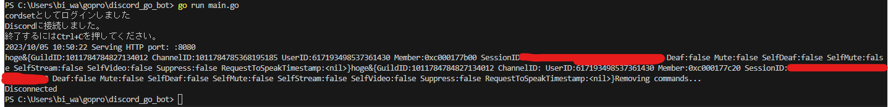

# discord.go多機能Botテンプレート
discordgoを使った多機能Botのテンプレートです。  
httpサーバーの立ち上げ、各機能のハンドラーの登録、コマンドの登録などができます。
# 使い方
本リポジトリをクローンして、以下のコマンドを実行してください。
```bash
go mod download
```
その後、.envファイルを作成し、以下のように記述してください。
```env
TOKEN=DiscordのBotのトークン
PORT=httpサーバーのポート番号
```

# コマンドの追加
```commands```フォルダーにコマンドファイルを追加してください。  
追加後、```main.go```にハンドラーを登録してください。


<details>
<summary>サンプルコード(例:pingコマンド)</summary>
commands/ping.go

```go:ping.go
package commands

import (
	"fmt"

	"github.com/bwmarrin/discordgo"
	botHandler "github.com/maguro-alternative/discord_go_bot/bot_handler"
)

func PingCommand() *botHandler.Command {
	/*
		pingコマンドの定義

		コマンド名: ping
		説明: Pong!
		オプション: なし
	*/
	return &botHandler.Command{
		Name:        "ping",
		Description: "Pong!",
		Options:     []*discordgo.ApplicationCommandOption{},
		Executor:    handlePing,
	}
}

func handlePing(s *discordgo.Session, i *discordgo.InteractionCreate) {
	/*
		pingコマンドの実行

		コマンドの実行結果を返す
	*/
	if i.Interaction.ApplicationCommandData().Name == "ping" {
		if i.Interaction.GuildID == i.GuildID {
			err := s.InteractionRespond(i.Interaction, &discordgo.InteractionResponse{
				Type: discordgo.InteractionResponseChannelMessageWithSource,
				Data: &discordgo.InteractionResponseData{
					Content: "Pong",
				},
			})
			if err != nil {
				fmt.Printf("error responding to ping command: %v\n", err)
			}
		}
	}

}
```

main.go

```go:main.go
    // ハンドラーの登録
	botHandler.RegisterHandlers(discord)

	var commandHandlers []*botHandler.Handler
	// 所属しているサーバすべてにスラッシュコマンドを追加する
	// NewCommandHandlerの第二引数を空にすることで、グローバルでの使用を許可する
	commandHandler := botHandler.NewCommandHandler(discord, "")
	// 追加したいコマンドをここに追加
	commandHandler.CommandRegister(commands.PingCommand())  // pingコマンドの追加
	commandHandlers = append(commandHandlers, commandHandler)
```

</details>

以下のような画像のように、コマンドが追加されていれば成功です。


# イベントハンドラーの追加
```bot_handler```フォルダーにハンドラーファイルを追加してください。  
(第二引数に変化が起きるとイベントが発生します。また都合上、onReadyは登録できません。)

<details>
<summary>サンプルコード(例:ボイスチャンネルのステータス変化)</summary>
bot_handler/vc_signal.go

```go:vc_signal.go
package botHandler

import (
	"fmt"

	"github.com/bwmarrin/discordgo"
)

func OnVoiceStateUpdate(s *discordgo.Session, vs *discordgo.VoiceStateUpdate ) {
    fmt.Print("hoge")
    fmt.Printf("%+v", vs.VoiceState)
}
```

bot_handler/handler.go

```go:handler.go
// ハンドラーの登録
func RegisterHandlers(s *discordgo.Session) {
	fmt.Println(s.State.User.Username + "としてログインしました")
	s.AddHandler(OnMessageCreate)
	s.AddHandler(OnVoiceStateUpdate)    // 追加
}

```
</details>

以下のような画像のように、ボイスチャンネルのステータスを受け取れていれば成功です。
